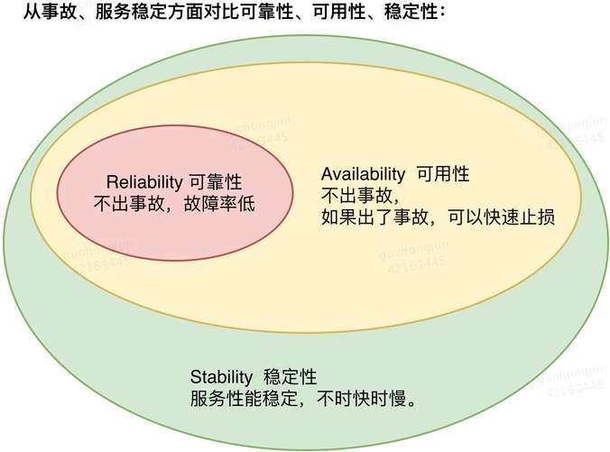

# 1 必要性
## 1.1 系统稳定性的定义
系统稳定性的定义是指当系统处于一个平衡状态时，如果受到外来作用的影响，系统经过一个过渡过程仍然能够回到原来的平衡状态，就称这个系统就是稳定的。这个定义是针对物理系统而言的，由于物理系统中存在储能元件，并且每个元件都存在惯性，这样当给定系统的输入时，输出量一般会在期望的输出量之间摆动。此时系统会从外界吸收能量。对于稳定的系统振荡是减幅的，最终会平衡于一个状态。举例来说，......。

对于软件系统而言，稳定性是指即使面对各种极端情况或突发事件时，系统仍然能够提供持续、可靠的服务能力，不致于对系统的状态发生显著的不良影响。我们通常所说的稳定性（Stability）、可用性（Availability）、可靠性（Reliability）是三层递进的关系，可靠性中包含了容错性，可用性之中包含了恢复性，其关系如下图所示。

可靠性关注的是降低故障率，故障的表象可分为错误输出、无输出、崩溃。可用性关注的是系统持续提供服务的时长，用户对系统故障无感。稳定性关注的是用户体验，即系统的行为是否具备一致性，是否符合用户的期望值从而让用户对系统产生心理上的认可度和依赖感。例如对于12306购票网站来说，出错票或501错误就是可靠性问题，不能访问或404错误就是可用性问题。

可靠性、可用性都是可以通过指标进行量化的，通过技术视角评判系统，而稳定性是在这些指标之上的综合定性考量，通过用户视角评判系统。

总结而言，稳定性就是系统一旦上线运行，那么无论面对什么情况都尽量不要出问题，如果出了问题也要求可以快速解决和恢复.对于系统而言，首要目标是不治已病治未病，降低故障的次数，频率要低，从而提高可靠性；其次是系统的容错能力，无论是一次错误的输出，或是一个依赖服务的崩溃都不应该影响系统自身的服务能力和正确性；再次不要让小病拖成大病，在故障出现后，要提高故障的恢复时间，速度要快，从而提高业务的可用性。

参考文献
* [对比Availability可用性、Reliability可靠性、Stability稳定性](https://www.cnblogs.com/ghj1976/p/dui-biavailability-ke-yong-xingreliability-ke-kao.html)

## 1.2 系统稳定性的影响因素
1. 系统设计
是否采用了成熟且经过验证的技术，是否进行了冗余设计，是否考虑了流量冲击、
有兜底，有熔断。对于外部依赖，一定要做到兜底和熔断，通过检测超时情况或者异常情况，当依赖服务不可用时可以使用本地的兜底策略，向上提供有损服务

2. 系统开发
开发人员是否具备极高的专业水平和责任心，代码是否标准化，

3. 系统验证
是否开展了各种压力测试和极限测试

4. 系统发布
无论多么经验丰富的人编写的代码，经过多么严格的测试验证， 都无法百分百避免问题遗漏， 所以变更发布一定要具备灰度和监控的能力

5. 环境因素
生产环境中会出现各种极端情况及突发事件，包括且并不局限于机房级故障, 城市级故障，线上故障, 线上业务量瞬时爆发, 持续快速增长, 系统服务器故障, 依赖数据库故障, 环境数据改变, 依赖系统故障等

生产环境中充满了混乱、无序、异常和各种噪声,数据的规模和负载上下波动，复杂分布式系统的并发性加剧了系统运行状态的随机性和不可预测性，进而引发一系列相关的竞态、死锁、野值、崩溃等设计边界之外的问题。

6. 运行时长
“如果事情有变坏的可能，不管这种可能性有多小，它总会发生。”，残酷的墨菲定律预示着我们对自己系统提供的服务不要太乐观。分布式系统虽然不存在物理系统那样的零件老化的问题，单其天生包含大量的交互、依赖点，可以出错的地方数不胜数，根据墨非定律，只要运行时间足够长，可能会出现的故障终究都会发生。例如负载的增加、硬件故障、软件缺陷、还有非法数据（有时称为脏数据）的引入。

7. 系统规模
功能繁多、组件混杂的系统，其稳定性保障的难度必然会大于职责清晰，功能单一的系统。不同的业务功能，其业务特征、业务形态、业务量、资源使用形式、依赖关系都各不相同，如果混合在一个系统中，将很难避免相互影响。微服务架构的风行推动了异构技术栈的交融，同时也带来了更多的不稳定因素。

分布式系统中太多的组件，频繁的改动和革新，无数非计划中的组件交互，部件之间的强弱依赖、递归依赖、循环依赖，人类是不可能把这些内容全都放在脑中，我们缺乏对复杂系统的掌控性和可理解性，我们无法为软件系统表现出的各种行为建立一个理论预测模型，埋下隐患也就不可避免。

8. 软硬件变化及用户新增需求
系统在持续地迭代、重构、升级。每天工程师和自动脚本都在通过不同的方式更新着系统，例如发布新代码，更改动态配置，添加持久化的数据，等等，势必会打破旧有的平衡。
在共享状态、缓存、动态配置管理、持续交付、自动伸缩、时间敏感的代码等等的作用之下，生产环境实际上处在一个无时不在变化的状态。

动态平衡就是所有复杂事物内在的基本规律：就其稳定的一面来看，它应该保持一定的平衡，以维持其性质的相对恒定性;而就其变易的一面来看，事物要发展，就必须保持动态的发展，不可能保持绝对的平衡与稳定。因此，系统动态平衡理论所要追求的状态，是既要使事物保持一种相对的不平衡，以使事物充满活力、动力和势能，使事物自身处于一种生机勃勃的动态发展状态之中，又要使事物本身保持一定的稳定性和平衡性，以保持整个事物的稳定，从不平衡走向新的更高级的平衡。但是从不平衡迈向新平衡的过程中，当系统失衡超过一定限度时，会使系统陷入崩溃状态。

参考文献
* [谈谈系统稳定性设计](https://yq.aliyun.com/articles/681441)
* [稳定性全系列（一）：如何做好系统稳定性建设](https://cloud.tencent.com/developer/news/599440)

## 1.3 面临的问题
系统稳定性面临着严峻的考验，主要表现在以下几个方面：

1. 故障层出不穷
实验室里运行良好的系统并且经过了层层的测试、拷机、所检、X检，到了实装环境就会出现各种意想不到的问题；

2. 阻碍产业升级
核心技术人员忙于四处救火，无法专注于技术和业务的探索和积累；对采用新技术、新架构心存顾虑，无法平滑升级

3. 影响企业声誉
影响了用户正常的使用，并且降低了单位的声誉

## 1.4 原因分析
1. 编码不规范
代码中缺乏防御式编程和故障应对预案

2. 验证不充分
仿真数据理想、完整而富有规律；测试用例与系统的业务流程完美契合,严格按照时序同步交互；测试环境纯净、高效、稳定。实验室里的验证是平稳、渐进且逻辑性强，跳不出常规的思维框架。

## 1.5 解决措施
影响系统稳定性的8个因素中后4个因素是无法控制或难以控制的，所以我们主要关注前4个因素。本文重点阐述从系统验证维度阐述如何提升系统稳定性。

“千里之堤毁于蚁穴“，如何发现系统中”蚁穴“是系统验证所不断追求的目标。传统测试只能告诉我们正在测试的系统中的某个属性的断言是真还是假。但现在我们需要更进一步发现会影响系统行为的更多未知属性。我们所感兴趣的是整个系统作为一个整体的行为，即使每一个单一组件的行为都是合理的，但是在特定场景下这些行为组合起来就可能导致系统预期之外的行为。

借助混沌工程这一技术手段，主动创造复杂多变、异于常态的运行环境，动态调整系统的依赖资源供给，实现或仿真各类软硬件失效情况，考察并改进系统应对未知风险的能力，以期提升系统稳定性。
